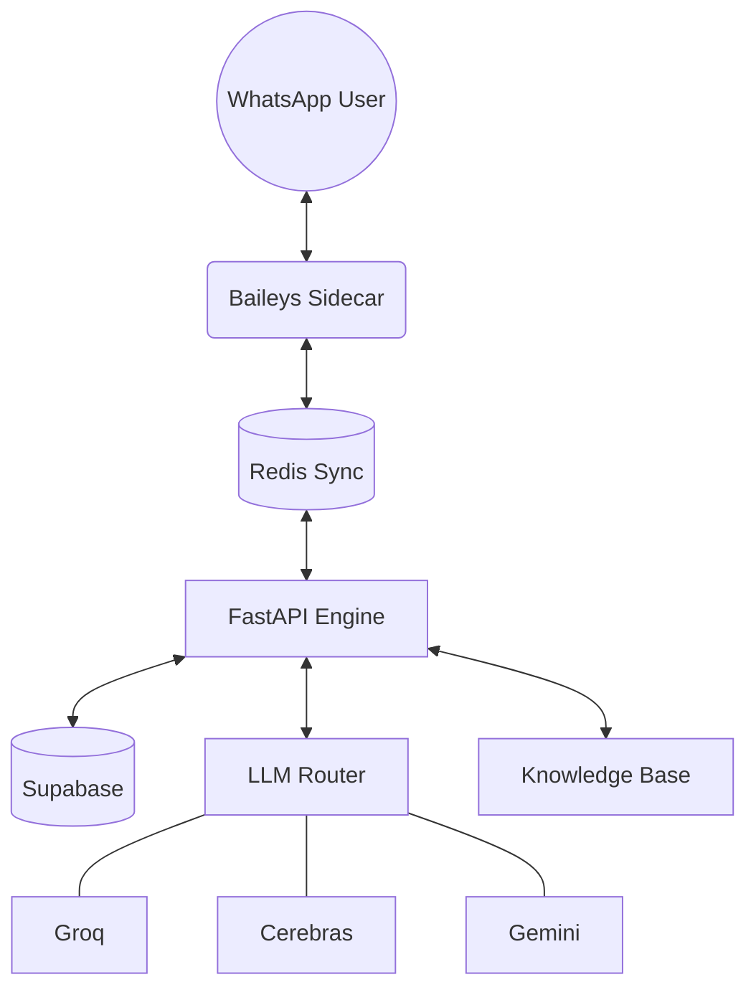

# 👁️ Markeye Mark: AI SDR Infrastructure v2.0.0


> **High-Agency Pipeline for Predictable Growth.**
> 
> Mark is a production-grade AI SDR infrastructure designed to handle inbound lead qualification, real-time interactive engagement, and automated sales orchestration with zero-cost inference and zero-latency execution.

---

## 🚀 The v2.0.0 Alpha Rebuild

This version represents a total architectural pivot from a basic bot to a scalable, multi-tenant AI infrastructure.

### 🧠 Intelligence & Orchestration
- **Smart LLM Router**: Dynamic fallback between **Groq**, **Cerebras**, and **Gemini**. High performance with practically zero operational cost.
- **Trigger-Action Engine**: LLM-driven execution of interactive polls, pricing delivery, and human sales escalations.
- **Semantic Cache**: Vecto-base cache for lightning-fast responses to common intents, bypassing LLM costs and latency.
- **High-Agency BANT**: Context-aware qualification that moves at the speed of human conversation.

### 📱 WhatsApp Mastery (Baileys v2)
- **Interactive Polls**: Friction-less lead qualification via WhatsApp-native multi-choice interactions.
- **Remote Onboarding**: Authentication via Pairing Codes — no physical QR scanning required.
- **Media Cloud-Sync**: Inbound images, docs, and voice notes are automatically uploaded to **Supabase Storage** and served via public URLs.
- **Natural Touch**: Probabilistic reactions (`👍`), human typing delays, and rich link previews for Calendly.

### 🏗️ Infrastructure & Scale
- **Multi-Tenant Architecture**: One deployment serves unlimited clients with isolated branding, system prompts, and knowledge bases.
- **Docker Orchestration**: Unified Compose setup for FastAPI (Conversation Engine) and Node.js (WhatsApp Sidecar).
- **Training Pipeline**: Automated pipeline for collecting, labeling, and exporting conversation data for fine-tuning.
- **Production Guardrails**: Instrumented with **Sentry** (telemetry) and **Redis** (atomic execution).

---

## 🛠️ Architecture



---

## 🚦 Quickstart

### 1. Environment Setup
Clone the repo and configure your `.env` (see `.env.example` for the full schema).

```bash
# Core Credentials
REDIS_URL=redis://localhost:6379
SUPABASE_URL=your_url
SUPABASE_KEY=your_key

# Choose your path
AUTH_MODE=qr # or pairing
```

### 2. Launch
The platform is fully containerized for one-click deployment.

```bash
docker-compose up --build -d
```

### 3. Monitoring
Access logs via Docker or monitor real-time exceptions and latency through Sentry.

```bash
docker-compose logs -f fastapi
```

---

## 🎯 Trigger Tags (For AI Orchestration)

Mark can execute complex maneuvers mid-conversation. Just include these tags in the system prompt:

- `[SEND_BOOKING_POLL]` — Launch interactive scheduling.
- `[SEND_PRICING]` — Dispatch sales collateral.
- `[SEND_CALENDLY]` — Drop a rich link preview.
- `[ESCALATE]` — Hand over to a human rep.

---

## 📈 Roadmap & ROI
- [x] Multi-tenant Client Management
- [x] Zero-Cost LLM Fallback (Smart Router)
- [x] Supabase Storage Ingestion
- [ ] Voice-to-Voice Realtime (Next)
- [ ] Financial ROI Dashboard (In Progress)

---

**Built by the Markeye Engineering Team.**  
*Shift from manual outreach to scalable infrastructure.*
