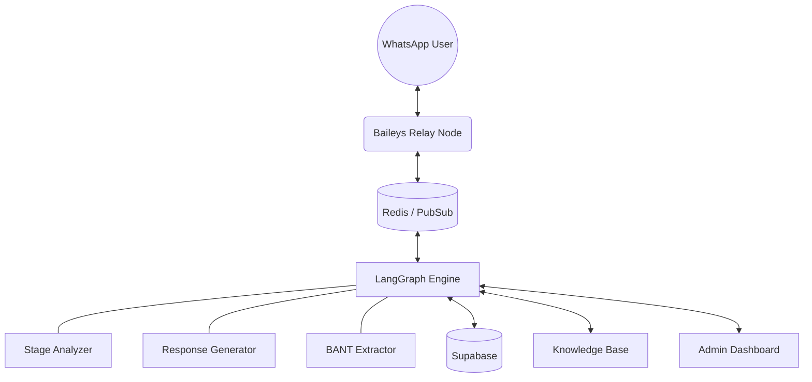

# 👁️ Mark AI SDR — Elite Agent Infrastructure v2.0.0

[](https://fastapi.tiangolo.com/)
[](https://nodejs.org/)
[](https://react.dev/)
[](https://langchain-ai.github.io/langgraph/)

> **High-Agency Pipeline for Predictable Growth.**
> 
> Mark is a production-grade AI SDR infrastructure designed to handle inbound lead qualification, real-time interactive engagement, and automated sales orchestration. Moving beyond simple bots, v2.0.0 introduces the **SalesGPT Dual-Chain** architecture for semantic conversation control.

---

## 🚀 The v2.0.0 "Elite SDR" Overhaul

This version represents a total architectural pivot from a basic bot to a scalable, multi-tenant AI infrastructure inspired by the top 1% of open-source sales agents.

### 🧠 Intelligence & Orchestration
- **LangGraph State Machine**: 9-node orchestration graph replacing monolithic logic with isolated, testable phases (Context → Analyze → Generate → Deliver).
- **SalesGPT Dual-Chain**: A semantic stage analyzer independent of the generator. It detects if a lead is in *Discovery*, *Qualification*, or *Booking* based on history, not just turn count.
- **BANT Extraction Engine**: Automated semantic scoring for **B**udget, **A**uthority, **N**eed, and **T**imeline that gates stage transitions.
- **Interrupt Protection**: Robust silence-buffering that pauses AI generation if the user sends follow-up messages during processing.

### 📱 Neural Tactical UI (`/admin`)
- **Integrated React Dashboard**: New high-agency dashboard built with a "Neural Tactical OS" / "Iron Man" aesthetic.
- **Node Management**: Real-time visibility into all $N$ WhatsApp instances.
- **One-Click Pairing**: Scan QR codes directly in the browser to establish new tactical relays in seconds.
- **Live Metrics**: Monitor token burn, cost USD, and relay health for each client.

### 🏗️ Infrastructure & Scale
- **Multi-Session Baileys Relay**: A dedicated Node.js service managing concurrent WhatsApp connections with Redis-backed authentication.
- **Redis Persistence**: Centralized auth state and conversation history, allowing for persistent sessions across container restarts.
- **Multi-Tenant Agency Logic**: Isolated knowledge bases, branding, and Calendly links for unlimited clients.

---

## 🛠️ System Architecture



---

## 🚦 Setup & Deployment

### 1. Environment Configuration
Clone the repository and copy `.env.example` to `.env`. Ensure you provide:
- **Supabase**: URL and Service Keys.
- **Redis**: Connection string (Upstash fully supported).
- **LLM Keys**: Groq (Primary), Gemini (Stage Analyzer), and Cerebras (Fallback).

### 2. Launch the Backend (Python)
```bash
pip install -r requirements.txt
python main.py
```

### 3. Launch the Relay (Node.js)
```bash
cd baileys-service
npm install
npm run dev
```

### 4. Setup the Dashboard (React)
```bash
cd after5-agent-front
npm install
npm run dev
```
*Note: The Python backend automatically serves the built dashboard in production at the `/admin` route.*

---

## 📱 Messaging Provider

Mark supports a dual-channel messaging architecture to balance development speed with production reliability.

1.  **Baileys mode** (`MESSAGING_PROVIDER=baileys`):
    - **Usage**: For local development and testing only.
    - **Mechanism**: uses a reverse-engineered library to emulate a WhatsApp Web session.
    - **Warning**: Never use for client accounts in production. High risk of WhatsApp ban.
2.  **WhatsApp Cloud API mode** (`MESSAGING_PROVIDER=whatsapp_cloud`):
    - **Usage**: Mandatory for all production deployments.
    - **Mechanism**: The official Meta API path.
    - **Requirements**: Needs `WHATSAPP_PHONE_NUMBER_ID` and `WHATSAPP_ACCESS_TOKEN` from Meta Business Manager.
3.  **Safety Lock**:
    - When `ENVIRONMENT=production`, the application automatically blocks the Baileys provider and forces `whatsapp_cloud` to protect account integrity.
4.  **Meta Template Requirement**:
    - The first outbound message to any new lead **MUST** be a pre-approved Meta message template.
    - Free-form messages are only allowed after the lead replies (opening the 24-hour customer service window).

---

## 🎯 Trigger Maneuvers
Include these tags in your knowledge base or system prompt to trigger agent actions:
- `[SEND_PRICING]` — Dispatches sales collateral immediately.
- `[SEND_CALENDLY]` — Drops a rich link preview for scheduling.
- `[ESCALATE]` — Triggers an SMS/WA notification to a human rep.
- `[SEND_POLL]` — Launches a native WhatsApp qualification poll.

---

## 📈 Roadmap
- [x] LangGraph Migration
- [x] Multi-Session Baileys Relay
- [x] SalesGPT Semantic Stage Analyzer
- [x] Integrated Neural Admin UI
- [ ] Voice-to-Voice Real-time (Active Dev)
- [ ] Automated Financial ROI Tracker

---

**Built by the Markeye Engineering Team.**  
*Shifting from simple code to high-agency engineering.*
