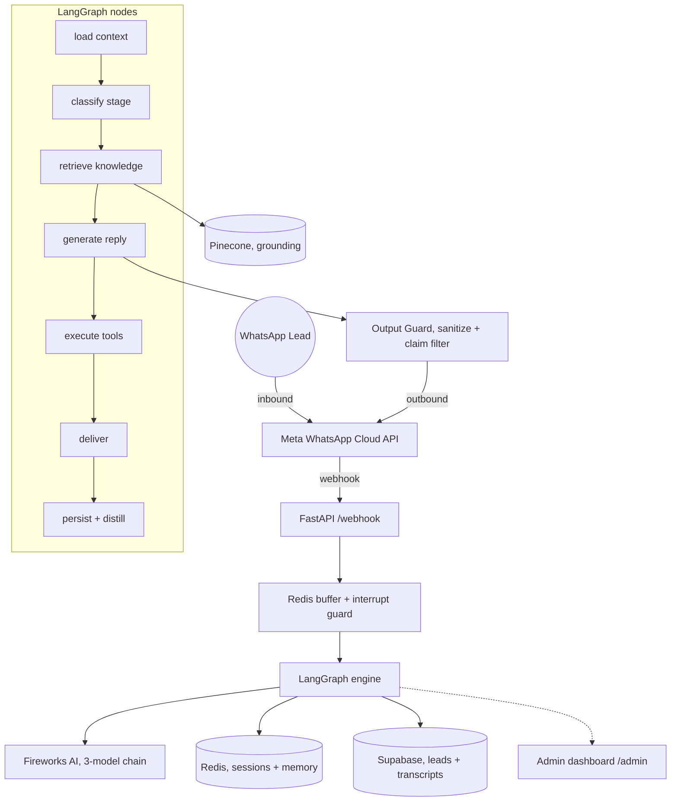

# 👁️ Mark, AI SDR for WhatsApp

[](https://fastapi.tiangolo.com/)
[](https://fastapi.tiangolo.com/)
[](https://langchain-ai.github.io/langgraph/)
[](https://developers.facebook.com/docs/whatsapp/cloud-api/)
[](https://fireworks.ai/)
[](https://www.pinecone.io/)

> **A human-sounding sales rep that qualifies inbound WhatsApp leads and books them onto discovery calls, around the clock.**
>
> Mark is a production FastAPI service that receives WhatsApp messages via the **official Meta WhatsApp Cloud API**, runs them through a **LangGraph** conversation engine powered by **Fireworks AI**, and books qualified leads, while staying on-persona and grounded in a real knowledge base.

---

## ✨ Highlights

- **Official Meta WhatsApp Cloud API** — no reverse-engineered libraries, no ban risk. Production runs entirely on Meta's supported path.
- **Fireworks-only LLM chain** — one provider, three models with automatic fail-fast fallback.
- **Context-engineered prompt** — a layered, per-turn assembled system prompt instead of one monolith (~60% fewer input tokens per reply).
- **Structured conversation memory** — durable per-lead facts that survive 30-40 message threads without "forgetting".
- **Retrieval grounding** — Pinecone-backed knowledge base so factual answers are retrieved, not hallucinated.
- **Deterministic guardrails** — a code-level output filter that strips banned claims, em dashes, and emojis on every message.
- **Flag-gated everything** — each capability toggles from a config var with instant rollback, no redeploy.

---

## 🏗️ Architecture



**Flow:** a lead messages the Meta number → webhook buffers rapid messages (5s silence / 8s hard-max) → LangGraph loads context, classifies the sales stage, optionally retrieves grounding from Pinecone, generates a reply via Fireworks, runs it through the output guard, and delivers it with human-like typing. In the background it distills structured lead memory and BANT signals into Redis + Supabase.

---

## 🧠 The Conversation Engine

| Layer | What it does | Source |
|---|---|---|
| **LangGraph graph** | 9 isolated, testable nodes: load → classify → retrieve → generate → tools → deliver → persist | `app/graph/` |
| **Layered context** | Assembles the system prompt per turn from `soul / facts / playbook / style` (+ `knowledge` only when relevant) | ADR 0001 |
| **Structured memory** | Per-lead record (company, pains, objections, booking status) distilled every turn | ADR 0003 |
| **Grounding** | Pinecone retrieval with integrated `llama-text-embed-v2` embeddings (no OpenAI) | ADR 0004 |
| **Output guard** | Deterministic strip of banned claims, em dashes, emojis before send | ADR 0004 |
| **BANT engine** | Background scoring of Budget / Authority / Need / Timeline gating the booking push | `app/bant.py` |

---

## 📊 Optimization Audit

The engine was rebuilt from a single 41k-character prompt into a context-engineered pipeline. Every optimization is measured, reversible, and behind a flag.

| Optimization | Before | After | Impact |
|---|---|---|---|
| **Prompt assembly** | 1 monolith, ~41,000 chars injected every reply | Layered, per-turn (~16k chars, KB loaded only when relevant) | **~60% fewer input tokens** (~10.3k → ~4.7k per reply) |
| **LLM providers** | 4 providers, model-override bug caused 404 cascades | Fireworks-only, 3-model fail-fast chain | Fewer failures, cheaper, simpler |
| **Slow-call handling** | SDK retried the same slow model (one call hit 77s) | `max_retries=0` → fail over to next model | No more minute-long stalls |
| **Long-thread memory** | Lossy summary blob, Mark "forgot" facts | Structured `lead_memory`, dedicated Redis key | Recall holds across 30-40 messages |
| **Factual answers** | Prompt-only, could hallucinate | Pinecone retrieval grounding | Answers are sourced, not guessed |
| **Hallucination control** | Instruction-only "never lie" | Deterministic output filter + evals | Banned claims can't ship |
| **Context window** | Last 10 raw messages | Configurable, default 35 | Richer recent context |

**Quality gates:** a deterministic eval harness (`tests/`) encodes every style/hallucination rule as a test (dashes, emojis, banned claims, memory-merge safety) so regressions can't silently ship.

Full decision records live in [`docs/adr/`](docs/adr/).

---

## ⚙️ Configuration Flags

All behavior toggles live in Heroku config vars (or `.env`) for instant rollback with no redeploy:

| Flag | Default | Purpose |
|---|---|---|
| `MESSAGING_PROVIDER` | `whatsapp_cloud` | Messaging channel (production is always Meta Cloud API) |
| `USE_LAYERED_CONTEXT` | `true` | Layered prompt assembly (ADR 0001) |
| `USE_STRUCTURED_MEMORY` | `true`* | Structured per-lead memory (ADR 0003) |
| `USE_PINECONE_GROUNDING` | `true`* | Pinecone retrieval grounding (ADR 0004) |
| `ENABLE_CLAIM_FILTER` | `true` | Deterministic banned-claims output filter (ADR 0004) |
| `MAX_CONTEXT_MESSAGES` | `35` | Recent raw messages sent to the LLM per reply |

*\*Default `false` in code; enabled in the production environment.*

---

## 🚦 Setup & Deployment

### 1. Configure environment
Copy `.env.example` to `.env` and provide:
- **Meta WhatsApp Cloud API**: `WHATSAPP_PHONE_NUMBER_ID`, `WHATSAPP_ACCESS_TOKEN` (permanent System User token), `WHATSAPP_BUSINESS_ACCOUNT_ID`, `WHATSAPP_VERIFY_TOKEN`.
- **Fireworks**: `FIREWORKS_API_KEY`.
- **Redis**: `REDIS_URL` (Heroku Key-Value Store).
- **Supabase**: `SUPABASE_URL`, `SUPABASE_SERVICE_KEY`.
- **Pinecone** (optional grounding): `PINECONE_API_KEY`.

### 2. Run the backend
```bash
pip install -r requirements.txt
python main.py          # serves on $PORT (health at /health)
```

### 3. Connect the Meta webhook
Point your Meta app's webhook to `https://<your-host>/webhook`, subscribe to the `messages` field, and use the same verify token as `WHATSAPP_VERIFY_TOKEN`. Subscribe the app to the WABA (`POST /{WABA_ID}/subscribed_apps`).

### 4. Ingest the knowledge base (for grounding)
```bash
python scripts/ingest_kb.py      # creates the Pinecone index and loads prompts/layers/knowledge.md + prompts/knowledge + prompts/objections
```
Re-run whenever the knowledge base changes (idempotent by record id).

### 5. Deploy
Push to `main` → Heroku auto-deploys. Confirm health via `/health` and `/metrics`.

---

## 📱 Messaging Provider

**Production runs exclusively on the official Meta WhatsApp Cloud API.** This is the supported, ban-safe path.

- The first outbound message to a new lead must be a pre-approved **Meta message template**. Free-form messages are only allowed inside the 24-hour customer service window opened by a lead's reply.
- Inbound webhooks can be HMAC-verified with `WHATSAPP_APP_SECRET` (recommended for production).

> A legacy Node.js Baileys relay exists in `baileys-service/` from earlier development. It is **not used in production** and is retained only for reference. Do not connect client numbers through it.

---

## 🎯 Agent Actions (trigger tags)

Mark appends these tags to the end of a message; they are stripped before the lead sees them:

- `[SEND_BOOKING_POLL]` — offer call times via a clickable poll
- `[SEND_CALENDLY]` — send the booking link (only when asked / agreed)
- `[SEND_PRICING]` — send the pricing overview
- `[ESCALATE]` — hand off to a human rep

---

## 🔍 Diagnostics

API-key-guarded read endpoints (require `X-API-Key: $OUTBOUND_API_KEY`):

- `GET /health` — liveness
- `GET /metrics` — uptime, message counts, LLM usage
- `GET /debug/prompt-source` — which prompt source is live (layered vs monolith) + active flags
- `GET /debug/memory/{phone}` — the structured `lead_memory` record for a lead

---

## 🗺️ Roadmap

- [x] LangGraph conversation engine
- [x] Migration to official Meta WhatsApp Cloud API
- [x] Fireworks-only LLM chain with fail-fast fallback
- [x] Layered context architecture (ADR 0001)
- [x] Eval harness (ADR 0002)
- [x] Structured conversation memory (ADR 0003)
- [x] Pinecone grounding + deterministic output filter (ADR 0004)
- [ ] Cross-conversation long-term memory
- [ ] Voice-to-voice real-time

---

**Built by the Markeye Engineering Team.** · [markeye.space](https://markeye.space)
